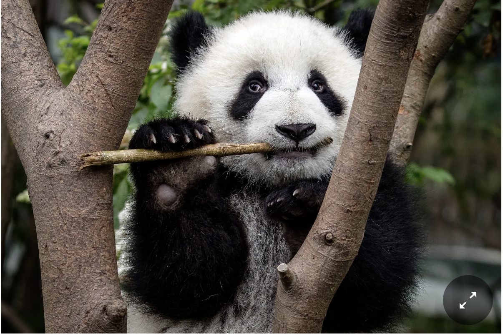

<html>
    <head>
    <link rel="stylesheet" href="extra.css">
    </head>
    <body>

    <h1>Extra Seed</h1>
    
Add an element of bootstrap to this page (ex. carousel) OR Add an element using Tailwind

<!DOCTYPE html>
<html>
<head>
<meta name="viewport" content="width=device-width, initial-scale=1">

</head>
<body>

<h2>Rounded Panda</h2>

</body>
</html> 

