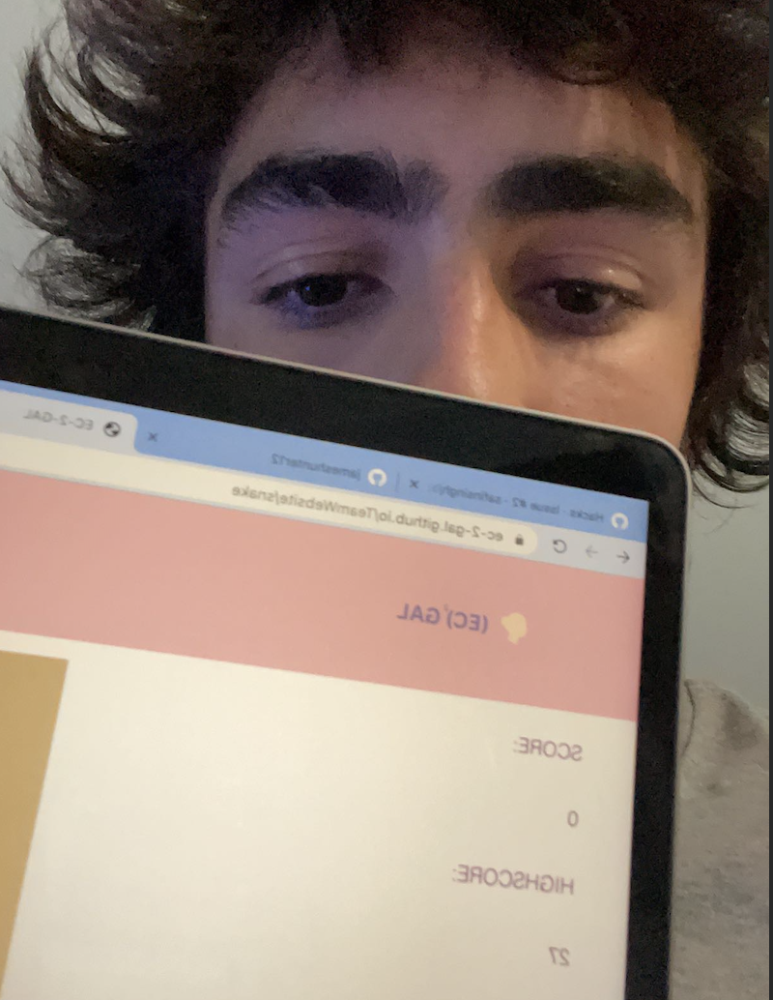

<!--Start of Website Content-->

    <h1>HACKS</h1>
    
Hacks for the Lesson on UI and Java
    
SNAKE SCORE BELOW

          <article class="profile">
            <picture class="profile-img">
              <source srcset="images/snake.png" media="(min-width: 600px)">
              

