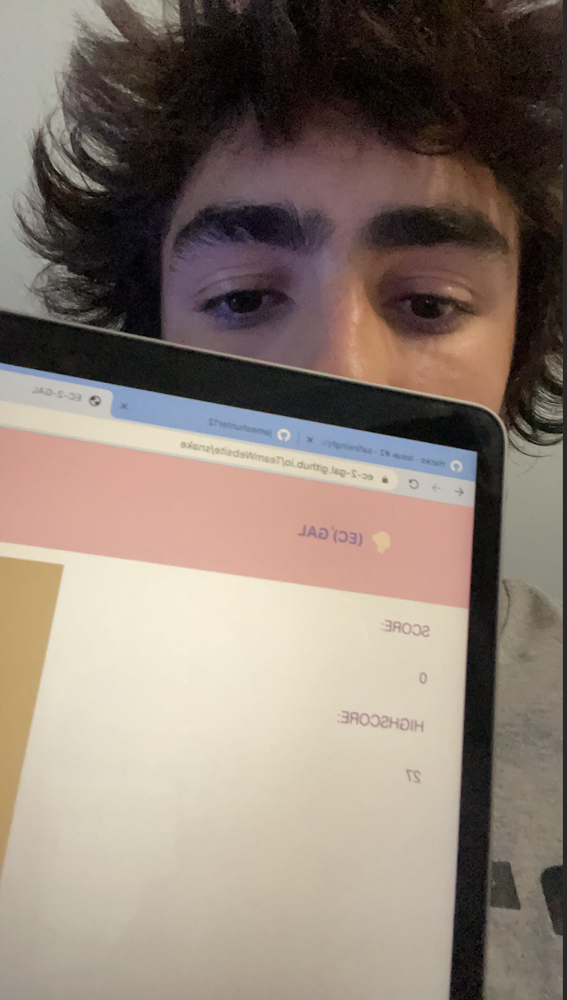

<!--Start of Website Content-->

    <h1>HACKS</h1>
    
Hacks for the Lesson on UI and Java
    
SNAKE SCORE BELOW

    
    <html>

<html>
<head>
<meta name="viewport" content="width=device-width, initial-scale=5">

</head>
<body>

<h2>Rounded Panda</h2>

</body>
</html> 

